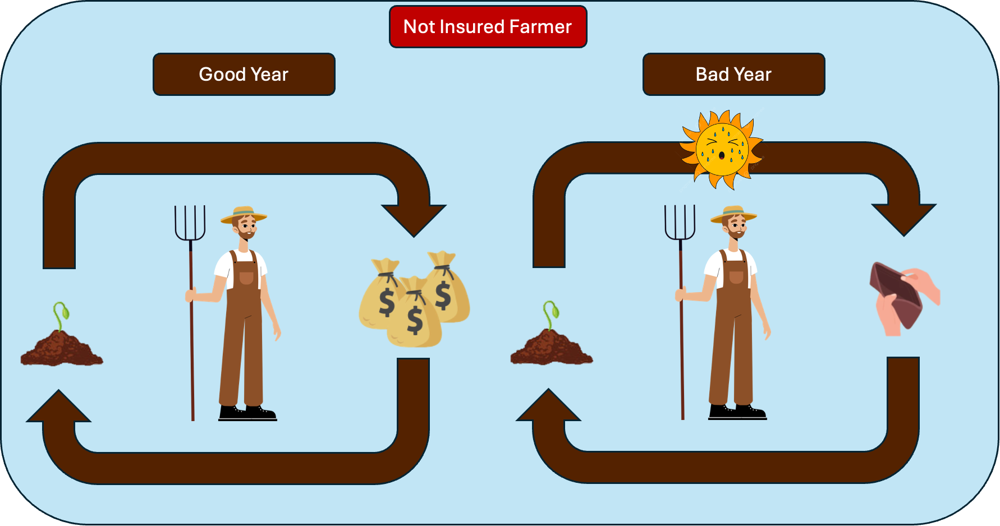
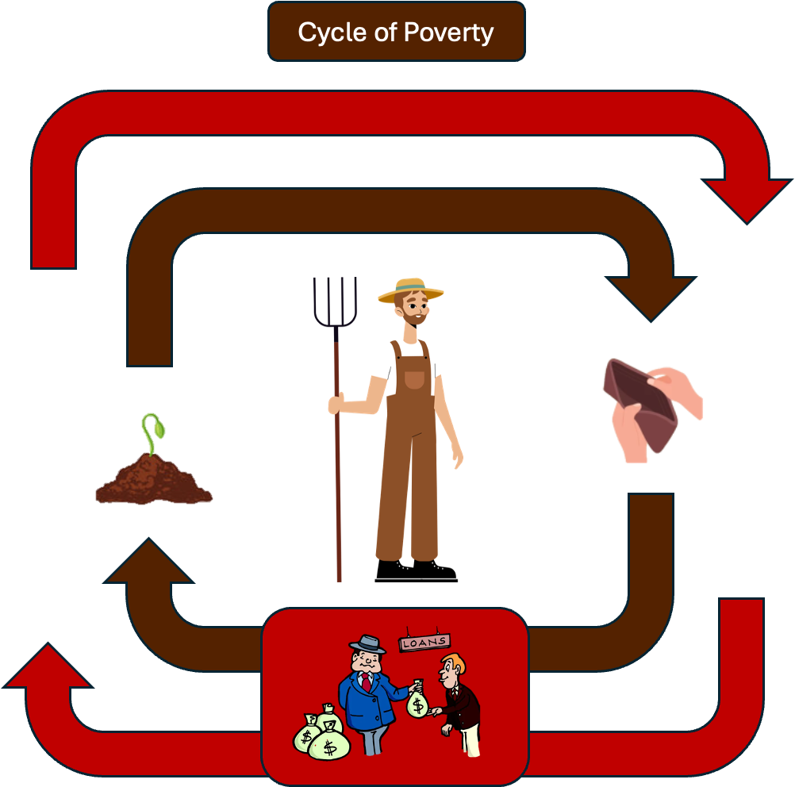
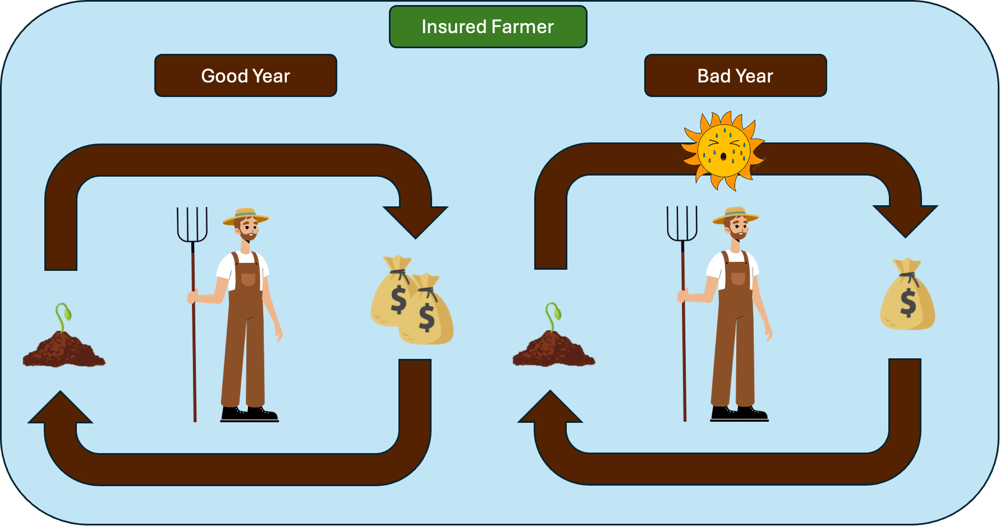
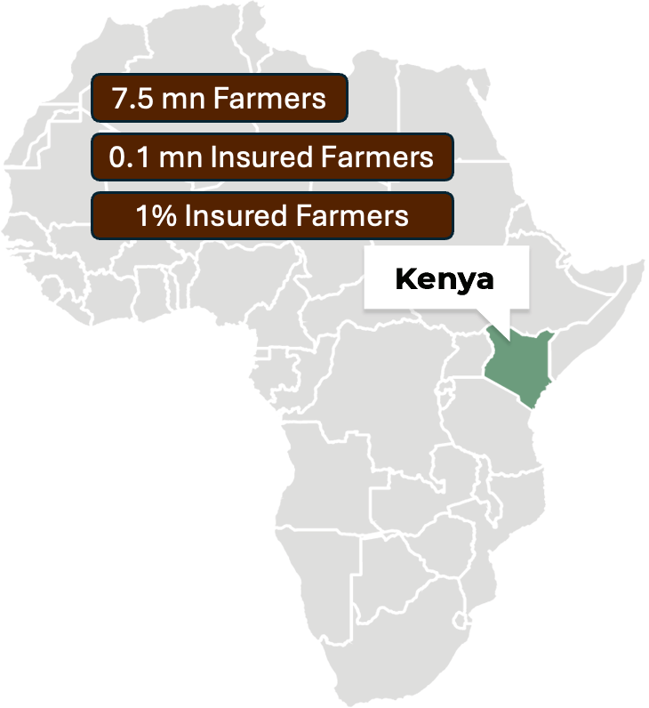
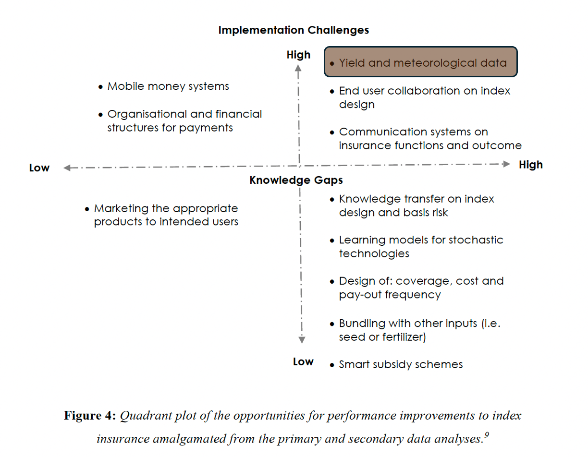
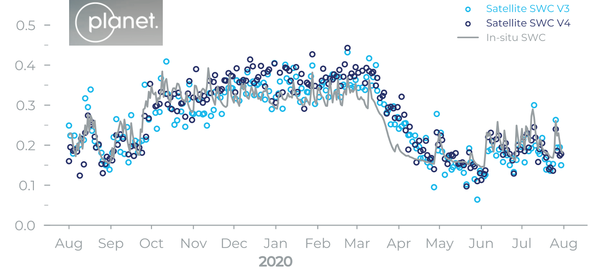

## Why do we care?

### Microinsurance can help to break the cycle of poverty
The idea for this project comes from a conversation with my good friend Sam Vosper, who for his PhD thesis [1] was investigating the cycle of poverty of farmers in rural Kenya, and how microinsurance schemes could help to break it. In his explanation he mentioned that the farmers have good and bad years, as ilustrated below. 

During the good years when the weather is good and the planted seeds yield a good harvest, they make money, and they can afford to spend it, and next year they have enough money to buy seeds and fertilizer. However, during the bad years when the weather is bad and the planted seeds yield a bad harvest, they don't have enough money to buy seeds and fertilizer for the next year. In those situations the farmers have to borrow money from the local moneylenders. Because quite often they don't have any collateral the interest are very high. This mean that even if they will make money next year, they will still be in debt. This puts them in a cycle of poverty, as ilustrated below.

One of the ways to break this cycle of poverty is to have a safety net. This safety net could be for instance an insurance scheme, which will cost some amount of money at the beggining of the season, and depending on the weather conditions during the season it will pay out some amount of money at the end of the season. In this situation when the weather is good, the farmer will earn still some money(although less), and during the bad years when the weather is bad, the insurance will pay out some money, which will help the farmer to buy seeds and fertilizer for the next year.

This can help the farmers to break the cycle of poverty, and allow them to invest in their future.

### Why farmers don't have insurance?

However, when looking at the numbers of insured farmers in Kenya, we see that only a small fraction of the farmers are insured.

Why is that? One of the big factor is that the yield indices that are used to determine the amount of money that the insurance will pay out are of not-sufficient quality. This means that despite the yields failing, the yield-index suggests that the yields are good, and the farmer is not paid out. This means that the insurance is not a safety net, but rather a ticket in a lottery. This then means that many farmers don't see the value in paying for the insurance.

## How do we want to help?

Vosper et al. [2] outlines following opportunities which could improve the quality of the insurance indices:

Given our background we want to focus on the top right quadrant, which is about improving the yield indices. One of the fundamental factor used to determine the yield is the **amount of rainfall** at key growth stages of a crop. This data is currently provided by the 5x5km resolution weather models. This is firstly not sufficient spatial resolution and secondly not fine-tuned for the Global South. This as a result does not allow for a good prediction of the yield indices. 

We want to adress this problem by providing a data on the **moisture content change of the soil**. With this data we will be able to measure the rainfall and improve the yield indices.

## State of the art:

Currently the state of art is a model provided by Planet, which uses their own satellites together with SMAP satellites to derive the absolute moisture content of the soil.

Their claimed accuracy of planet's model is $0.04\text{m}^3/\text{m}^3$. The uncertainty of the model is unfortunatelly not sufficient to for predicting whether it was raining or not for all the cases. As you can see on the plot above, the jumps in the data correspond to the rainfall events, yet the planet's sensor is not able to capture it due to the high uncertainty.

Recently there was also a paper published [3], which used the physics informed neural network to predict the soil moisture content. The paper claims the mean absolute error of $0.05\text{m}^3/\text{m}^3$. The model was trained directly on the ground truth data from ISMN network.

## How to go beyond the state of the art?

So why do we believe that we can do better?
- We want to solve simpler problem. Predicting absolute values of anything is hard, but predicting changes between two points in time is usually much easier. For the purpose of predicting the rainfall this is a good enough solution, and will be most likely more accurate than [3] even if one would use analogous methods.
- We want to train the model on the synthetic data, which allows us to adress the problem of lack of data in the Global South. The fact that that we want to focus on the changes in the moisture content and not the absolute moisture content allows us to generate such synthetic data set (A method borrowed from methane prediction research [4])

## References:
[1] [Microfinance and Mobile phones: an economic analysis of the perceptions, management and measurement of environmental risk in rural Kenya](https://doi.org/10.17863/CAM.86567)

[2] Insurance Under-performance: What is the Future of Index Insurance? A systematic review and evidence gap analysis. Vosper et al.

[3] [Global long term daily 1km surface soil moisture dataset with physics informed machine learning](https://doi.org/10.1038/s41597-023-02011-7)

[4] [Automatic detection of methane emissions in multispectral satellite imagery using a vision transformer](https://doi.org/10.1038/s41467-024-47754-y)