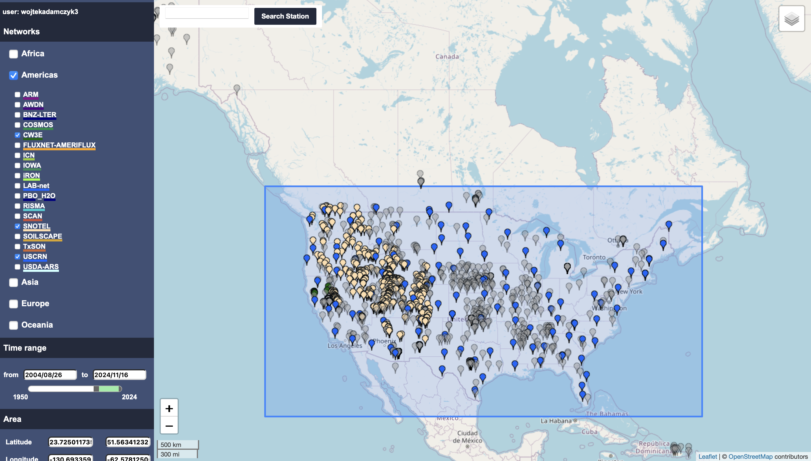

# Introduction - In-Situ data
For validation and training of the mudNN we require in-situ ground based truth data. To start we will use the International Soil Moisture Network (ISMN) data to train a machine learning supervised model. ISMN network provides a global coverage of in-situ measurements of soil moisture and is based on the collaboration of multiple networks of stations. Each of the networks has uniform data format and metadata. 

It is speciically easy to use this data, as the ISMN provides a [python interface](https://ismn.readthedocs.io/en/latest/index.html) to access the data. 

Other possible sources of data to look into is:
- SMAP
- Planet data
- Suominet (GPS network of PWV data)

We were thinking of using synthetic data to train the mudNN, but this possibility is left to be explred as for the shortness of time we dont want to spend too much time on it. 

## International Soil Moisture network (ISMN)
- Global in-situ measurements. It is build to be used to validate satellite data. Data is available on [ismn.earth](https://ismn.earth/en/data/data-availability)

## Region of Interest
We want to focus on few networks to start with. We will look into the following networks:


This includes the following networks:
- SNOTEL
- CW3E
- USCRN

We included only those networks as we are mainly interested in the California region, which has substaintial amount of agriculture.

All those networks are in the US. 

## Sensor types and depths

Each of those networks has slightly different sensor types and depths of moisture measurements. 

CW3E network has following sensor types:
```
- CS616_soil_moisture_0.050000_0.050000
- CS616_soil_moisture_0.100000_0.100000
- CS616_soil_moisture_0.150000_0.150000
- CS616_soil_moisture_0.200000_0.200000
- CS616_soil_moisture_0.500000_0.500000
- CS616_soil_moisture_1.000000_1.000000
```

SNOTEL network has following sensor types:
```
- Hydraprobe-Analog-(2.5-Volt)_soil_moisture_0.050800_0.050800
- Hydraprobe-Analog-(2.5-Volt)_soil_moisture_0.203200_0.203200
- Hydraprobe-Analog-(2.5-Volt)_soil_moisture_0.508000_0.508000
```

USCRN network has following sensor types:
```
- Stevens-Hydraprobe-II-Sdi-12_soil_moisture_0.050000_0.050000
- Stevens-Hydraprobe-II-Sdi-12_soil_moisture_0.100000_0.100000
- Stevens-Hydraprobe-II-Sdi-12_soil_moisture_0.200000_0.200000
- Stevens-Hydraprobe-II-Sdi-12_soil_moisture_0.500000_0.500000
- Stevens-Hydraprobe-II-Sdi-12_soil_moisture_1.000000_1.000000
```

As we are mostly interested in the shallow soil moisture, we will focus mostly on 0.05m depth, but also 0.2m depth sensors. 


